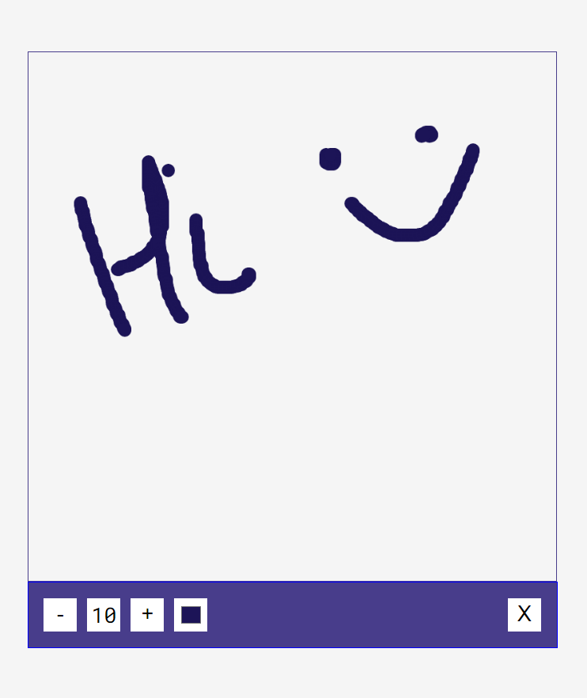

<h1 align="center">Drawing App</h1>

  <h3>
    <a href="https://rogue-shark.github.io/Drawing_App">
      D E M O
    </a>
     | 
    <a href="https://github.com/rogue-shark/Drawing_App">
      Solution
  </h3>

<!-- TABLE OF CONTENTS -->

## Table of Contents

- [Overview](#overview)
  - [Built With](#built-with)
- [Features](#features)
- [Contact](#contact)

<!-- OVERVIEW -->

## Overview

### Built With

## Features

## Contact

- GitHub [@rogue-shark](https://github.com/rogue-shark)
- Codepen [@rogue-shark](https://codepen.io/rogue-shark)